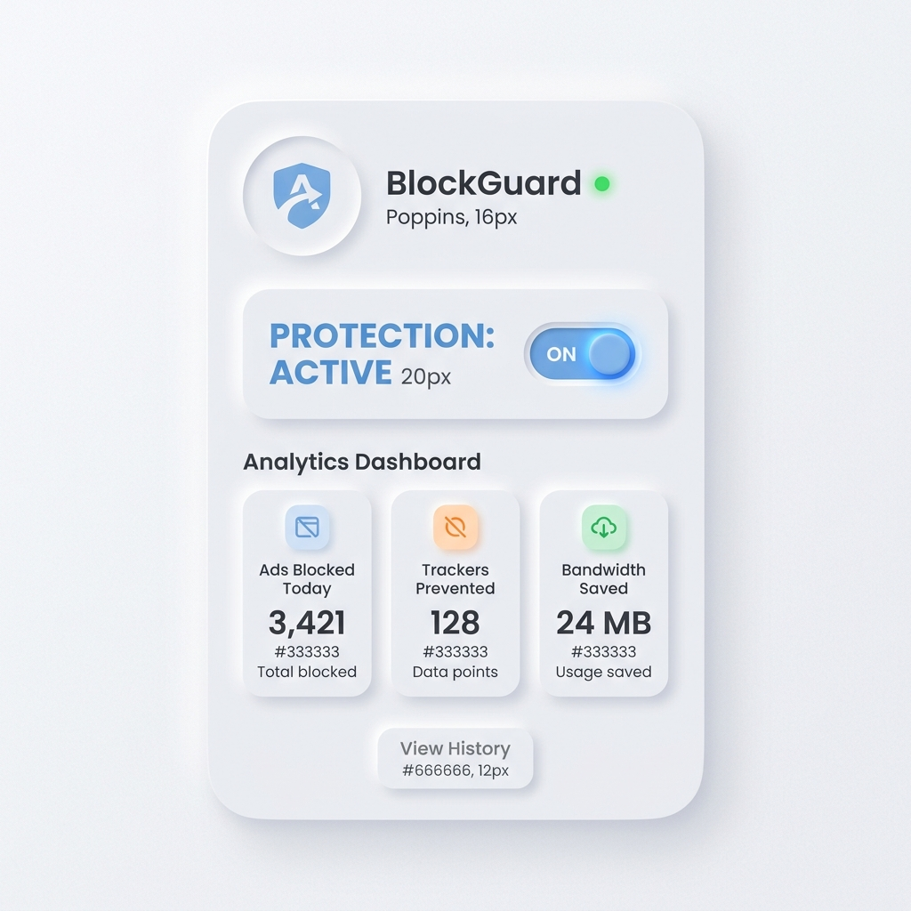

# Blockium Adblocker

  

Blockium is a modern, lightning-fast Chrome extension built on **Manifest V3**. It provides robust network-level ad blocking, cosmetic filtering, and advanced ad-skipping algorithms designed to defeat complex server-side ads on premium streaming platforms.

  

## 🚀 Key Features

- **Modern Neumorphism UI**: A beautiful, tactile "Soft UI" dashboard that looks incredible and feels native to modern operating systems.
- **Manifest V3 Core Engine**: Utilizes the latest `declarativeNetRequest` API for zero-overhead, ultra-fast network blocking.
- **Real-time Analytics**: Tracks ads blocked and calculates bandwidth saved on the fly.
- **Dynamic Badge Counter**: Instantly displays how many ads were blocked on the current page right on the extension icon.

## 🎯 Advanced Ad-Skipping Support

Blockium goes beyond standard network blocking. We have engineered dedicated, platform-specific content scripts to fight back against the newest unskippable ads:

- **YouTube**: Bypasses YouTube's new Server-Side Ad Insertion (SSAI). When an ad plays, Blockium silently intercepts the HTML5 video player and forces it to fast-forward to the very end instantly.
- **Amazon Prime Video / Freevee**: Uses a highly aggressive brute-force algorithm. Since Amazon obfuscates their ad code, Blockium monitors the length of the video playing. If it's a short 3-minute video playing before your movie, it instantly mutes and fast-forwards it at 16x speed!
- **Hotstar**: Contains dedicated DOM-cleaning rules to strip out native banner ads without breaking the video player.

## 🛠️ Developer Mode Installation

Since this is a custom, unlisted extension, you will need to install it manually:

1. Download or clone this repository to your computer.
2. Open Google Chrome.
3. In the address bar, type `chrome://extensions/` and hit Enter.
4. Look at the top right corner of the page and turn on the **Developer mode** toggle.
5. Click the **Load unpacked** button that appears in the top left.
6. Select the `adblocker` folder that you just downloaded.
7. *Optional but recommended*: Click the puzzle piece icon in your browser toolbar and "Pin" Blockium so you can easily access the Neumorphic dashboard!

---
*Built with ❤️ using the latest Manifest V3 web standards.*
