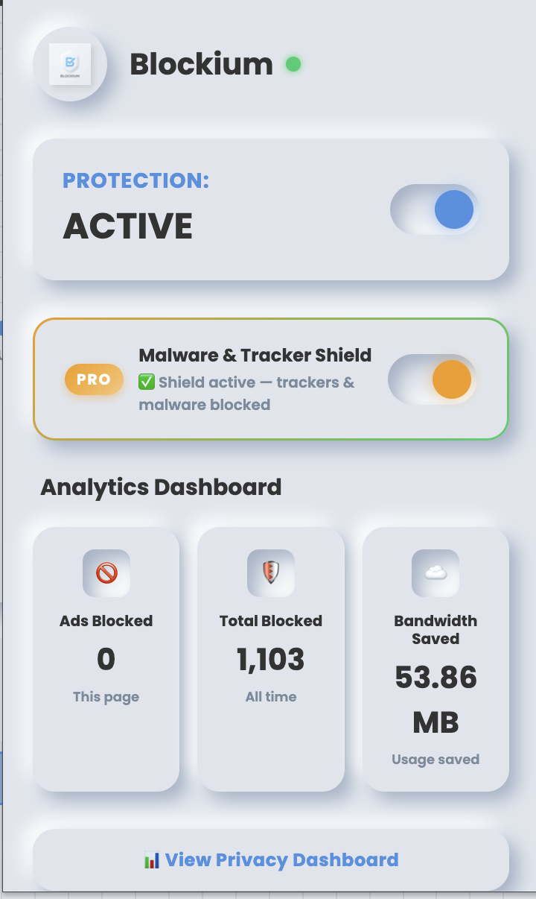
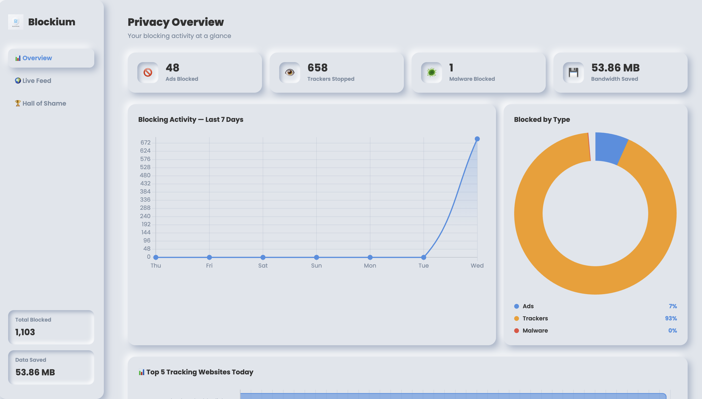
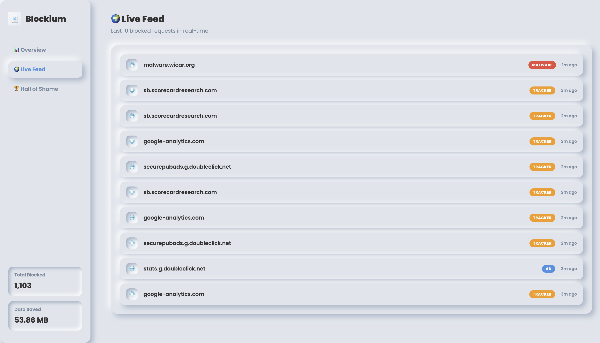
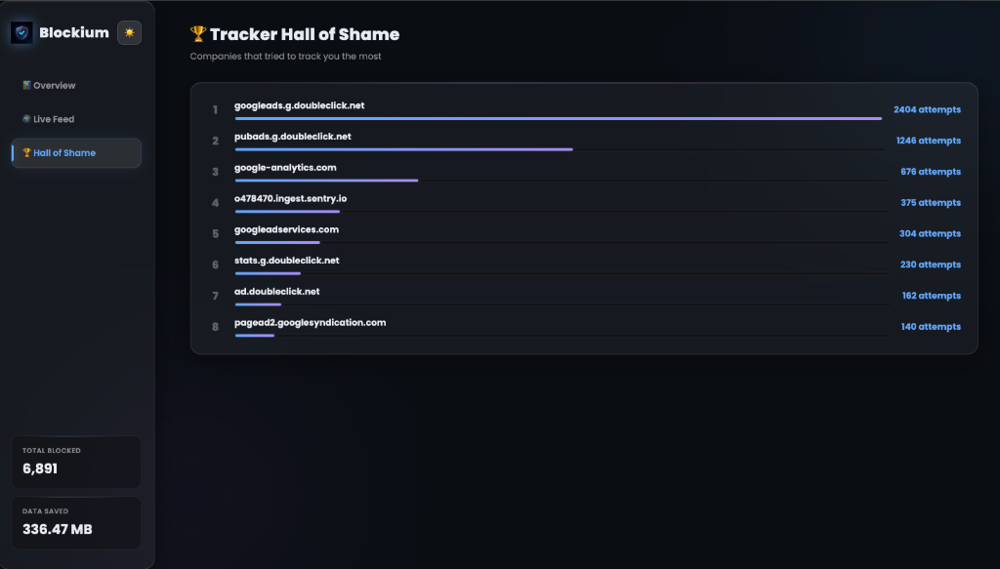

# Blockium Adblocker

<p align="center">
  
</p>

<p align="center">
  <strong>A premium, lightning-fast Chrome extension powered by Manifest V3.</strong><br>
  Block ads, trackers, malware and phishing sites — with a beautiful real-time Privacy Dashboard.
</p>

---

## 📸 Screenshots

### Extension Popup
<p align="center">
  
</p>

### Privacy Dashboard — Overview
<p align="center">
  
</p>

### Privacy Dashboard — Live Feed
<p align="center">
  
</p>

### Privacy Dashboard — Tracker Hall of Shame
<p align="center">
  
</p>

---

## 🚀 Key Features

### 🎨 Liquid Glass & Smart Utilities
- **Liquid Glass Theme** 🌗 — Switch between a premium, frosted-glass dark theme and light theme directly from the popup header. Theme settings automatically sync between the popup and the main privacy dashboard.
- **Threat Notification Alerts** 🔔 — Opt-in real-time desktop alerts when malware or tracker requests are blocked. Smart anti-spam logic limits notifications to one per category/tab to prevent visual clutter.
- **Cookie Consent Auto-Dismiss** 🍪 — Automatically rejects cookie popups and banners on 10+ major frameworks (OneTrust, Cookiebot, Osano, Didomi, Complianz, CookieYes, Termly) using smart DOM observation, and falls back to hiding annoying banners to restore normal page scrolling.
- **Speed/Page Load Timer** ⚡ — Real-time performance analysis measuring page load times of current tabs via Navigation Timing APIs. Collects global load speed statistics to display running average performance inside the Privacy Dashboard.

### 🆓 Free Tier
- **Manifest V3 Core Engine** — Uses Chrome's native `declarativeNetRequest` API for zero-overhead, ultra-fast network-level ad blocking.
- **Neumorphism UI** — Beautiful, tactile "Soft UI" popup with real-time analytics (Ads Blocked, Total Blocked, Bandwidth Saved).
- **Dynamic Badge Counter** — Instantly shows how many ads were blocked on the current page on the extension icon.
- **Streaming Ad-Skipping** — Dedicated content scripts for YouTube, Amazon Prime Video, and Hotstar.

### 👑 PRO Tier — Malware & Tracker Shield
- **Tracker Blocking** — Silently blocks invisible tracking scripts from Google Analytics, Facebook Pixel, TikTok, Hotjar, Segment, Mixpanel, and more.
- **Malware Protection** — Blocks known malware domains and drive-by download sites before they can load.
- **Phishing Protection** — Intercepts known phishing URLs before the page opens.
- **Cryptomining Block** — Stops browser-based cryptocurrency miners (Coinhive, Minero, JSECoin, etc.) from hijacking your CPU.

---

## 📊 Real-time Privacy Dashboard

Click **"📊 View Privacy Dashboard"** in the popup to open a full-page analytics dashboard:

| Section | What it shows |
|---|---|
| **Overview** | 4 stat cards + 7-day blocking activity line graph + Blocked-by-Type donut chart + Top 5 tracking websites bar chart |
| **Live Feed** | Real-time log of the last 10 blocked requests with domain name, type badge (AD / TRACKER / MALWARE), and timestamp |
| **Hall of Shame** | Ranked leaderboard of the companies that tried to track you the most, with attempt counts |

The dashboard **auto-refreshes every 5 seconds** so you can watch blocks happening in real-time.

---

## 🎯 Advanced Ad-Skipping Support

| Platform | Method |
|---|---|
| **YouTube** | Detects ads via the HTML5 video player and instantly fast-forwards to the end. Also auto-clicks "Skip Ad" buttons. |
| **Amazon Prime Video** | Detects Freevee ads by duration (< 3 min) and fast-forwards at 16× speed. |
| **Hotstar** | Cosmetic DOM filtering to strip banner and overlay ads without breaking the player. |
| **All websites** | Network-level blocking of ad servers, tracking pixels, and analytics scripts. |

---

## 🛠️ Developer Mode Installation

1. Download or clone this repository.
2. Open Google Chrome → go to `chrome://extensions/`.
3. Turn on **Developer mode** (top right toggle).
4. Click **Load unpacked** and select the `adblocker` folder.
5. Pin Blockium from the puzzle-piece icon in the toolbar.
6. Enable the **PRO toggle** inside the popup to activate Malware & Tracker Shield.

---

## 🗂️ Project Structure

```
adblocker/
├── manifest.json          # MV3 manifest with dual rulesets
├── background.js          # Service worker: ruleset control + analytics tracking
├── content.js             # Cosmetic filtering for all websites
├── cookie-consent.js      # Cookie consent auto-dismiss engine
├── youtube.js             # YouTube ad-skip content script
├── prime.js               # Amazon Prime ad-skip content script
├── rules.json             # Core ad-blocking rules (always enabled)
├── malware_rules.json     # PRO tracker/malware rules (enabled on demand)
├── popup/
│   ├── popup.html         # Neumorphic popup UI
│   ├── popup.css          # Soft UI styles
│   └── popup.js           # Popup logic + toggle handlers
├── dashboard/
│   ├── dashboard.html     # Full-page privacy dashboard
│   ├── dashboard.css      # Dashboard styles
│   ├── dashboard.js       # Chart.js charts + live data loader
│   └── chart.min.js       # Bundled Chart.js (no CDN, CSP compliant)
├── icons/                 # Extension icons (16, 48, 128px)
└── assets/                # README screenshots
```

---

*Built with ❤️ using Manifest V3 web standards. Version 2.0.0*
